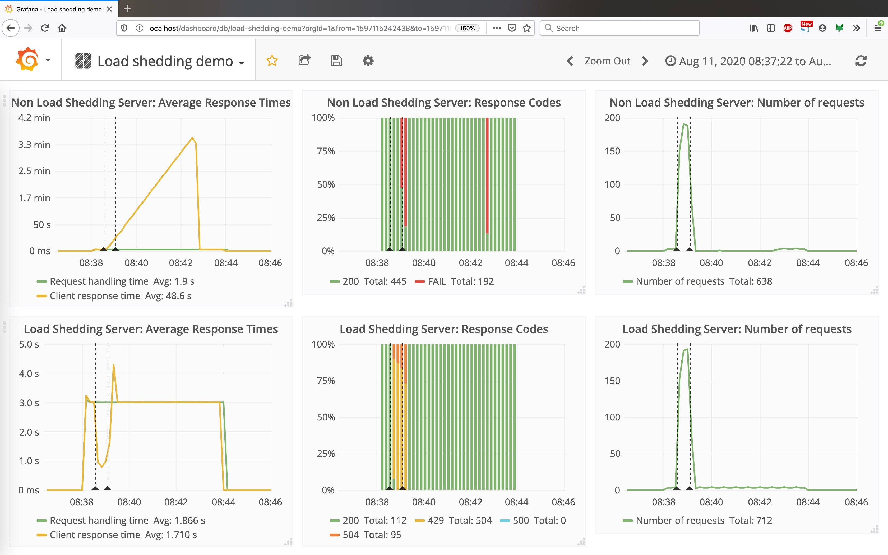
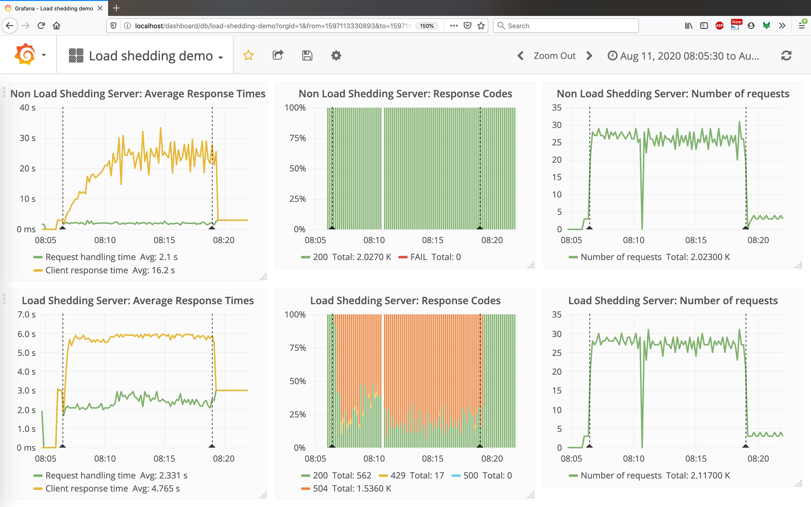

# Procrustes

This is a demo on load shedding in Clojure/Ring servers. It aims to show the difference
between a server that sheds load and one that does not. The Makefile contains the entry
points to start the servers and a few client utilities to demonstrate the behaviour of
these servers under load.

The load shedding strategy is basic, in the sense that it does not dynamically adapt to
changing conditions, the [Google SRE
blog](https://cloud.google.com/blog/products/gcp/using-load-shedding-to-survive-a-success-disaster-cre-life-lessons)
calls this kind of load shedding a Procrustean load shedding.

> You may recall, Poseidon's son Procrustes had a very, um, one-size-fits-all approach to
> accommodating his overnight guests. In its simplest form, load shedding can be a bit
> like that too: observe some easily obtained local measure like CPU load, memory
> utilization or request queue length, and when this load number crosses a predetermined
> "safe" level as established by load testing, drop a fraction of incoming traffic to
> bring the load back to safe levels.

## Strategy for load shedding

This approach focuses on the following goals:
1. Bounded waiting time in the request queue
2. Unblocking client via timeouts
3. Limited number of open requests in the system

To achieve this, we are using a custom fork of [Ring](https://github.com/mourjo/ring),
mainly to get the ability to:
1. Track the time a request was ingested into the server
2. Control how an asynchronous handler in Jetty responds to the client upon timeout

The second requirement was merged into Ring in this [pull
request](https://github.com/ring-clojure/ring/pull/410) but the first one is still
required for this demo. The fork is available on Clojars: `mourjo/ring-jetty-adapter`.

## Dependent services
This uses the following dependencies on ports (which can be installed via [this docker
image](https://github.com/kamon-io/docker-grafana-graphite)):
1. Grafana on localhost:80
2. Statsd on localhost:8125

Additionally, the servers themselves start a JMX server for the demo clients to dynamically
control how long a route should take (to simulate a downstream dependency becoming slow).

## Building the servers

To compile the code:
```shell
make compile
```

To start the load shedding server (hard coded to run at port 3100):
```shell
make load_shedding_server
```

To start the non load shedding server (hard coded to run at port 3200):
```shell
make non_load_shedding_server
```

To send a burst of requests to the servers:
```shell
make burst_request
```

To send a steady rate of requests and increasing the route processing time after a while:
```shell
make steady_requests
```

## Results

The clients used for the demo are in the namespace `procrustes.client`.

In the first demo, we use `procrustes.client/burst` to simulate a burst of requests coming
in in a short duration. The load shedding server never makes the client wait for too long,
while the non load shedding server lets the queue build up over time, affecting response
time severely:





In the second demo using `procrustes.client/steady`, we keep the rate of requests constant
but increase the time taken to process a request from 3 sec to 4 sec, shortly after the
demo is started (this is done via JMX). The load shedding server rejects service to
requests that otherwise would have degraded the service response time, as is seen in the
case of the non load shedding server:




A video of the demo is available
[here](https://drive.google.com/file/d/15IAeuQzQyzFra-eKdrWyC735s8_m5hxz/view?usp=sharing).

## License

Copyright © 2020 Mourjo Sen

This program and the accompanying materials are made available under the
terms of the Eclipse Public License 2.0 which is available at
http://www.eclipse.org/legal/epl-2.0.

This Source Code may also be made available under the following Secondary
Licenses when the conditions for such availability set forth in the Eclipse
Public License, v. 2.0 are satisfied: GNU General Public License as published by
the Free Software Foundation, either version 2 of the License, or (at your
option) any later version, with the GNU Classpath Exception which is available
at https://www.gnu.org/software/classpath/license.html.
